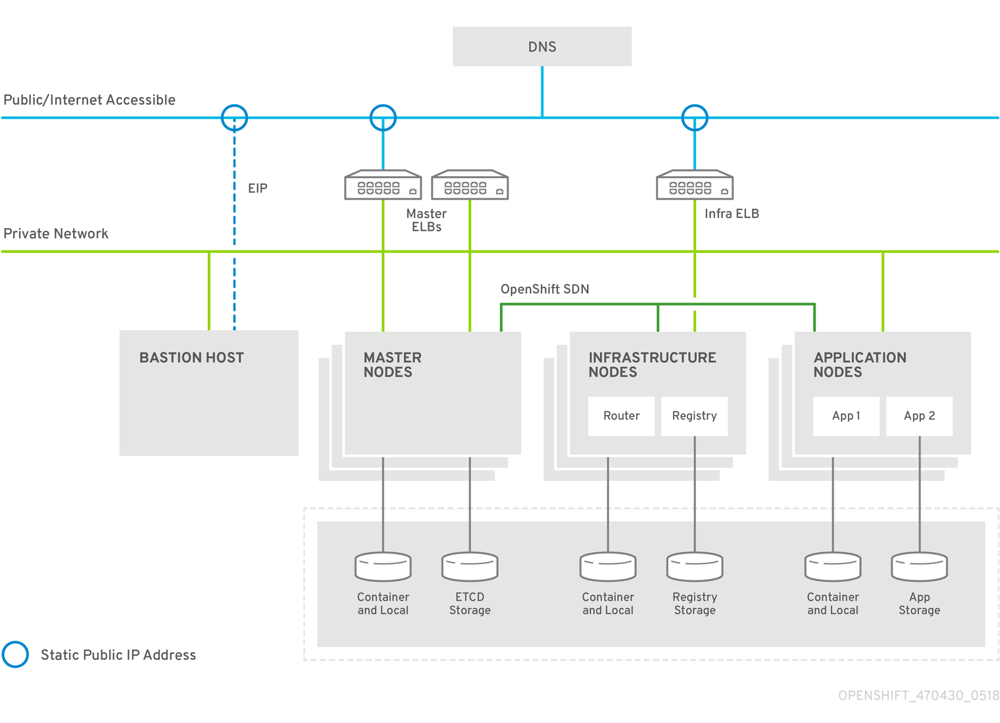
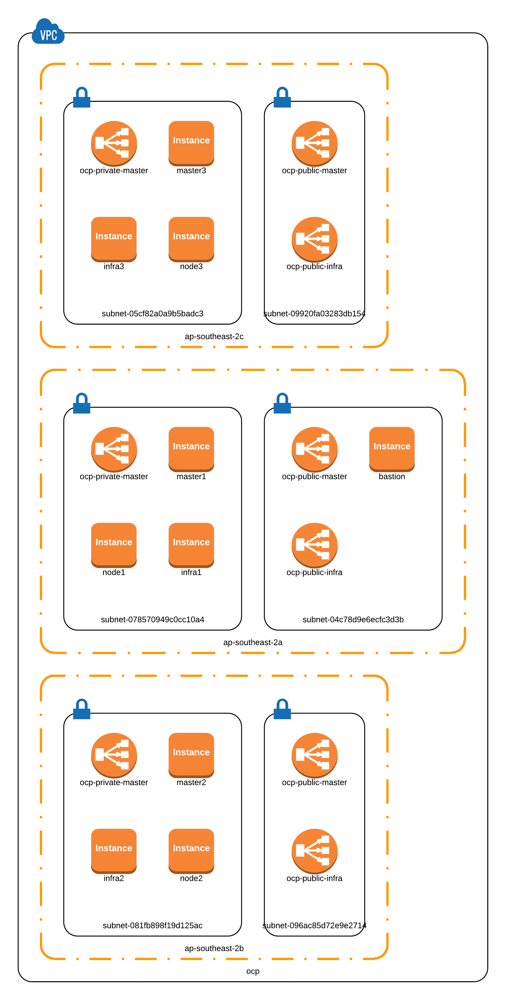

# OpenShift AWS Install The Hard Way

To run straight from the documentation

```bash
# https://gitlab.com/nul.one/rundoc
pip3 install rundoc --user
rundoc run ocp-3.11.md --single-session bash
```

## Versions
OpenShift 3.11 [here](ocp-3.11.md)





